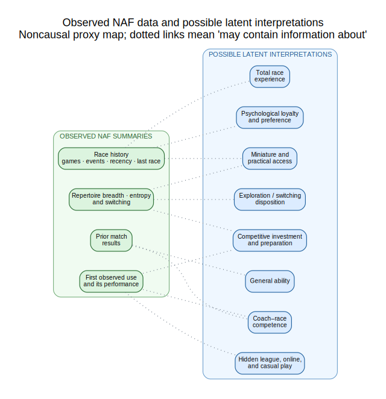

# Conceptual coach, race-choice, and performance network

Status: discussion artifact only. This is a deliberately expansive map of the
conceptual domain, not a proposed v1 model, causal-identification claim, or
implementation specification. Its purpose is to expose assumptions, omitted
paths, observational equivalences, and possible simplifications before a
smaller statistical model is chosen.

## 1. Gold-standard conceptual network

Read this as one event-time slice, `t`. Anything labelled "prior" occurred
strictly before the current event. The next-period arrows at the bottom make
the learning and loyalty feedback explicit without creating a same-time
causal cycle.

```mermaid
flowchart TB
  subgraph DEEP[Relatively persistent coach characteristics]
    TAL[General game talent<br/>planning, calculation, risk judgement]
    STAL[Style-specific aptitude<br/>Bash and Ag]
    LR[Learning rate / attainable skill ceiling]
    MOT[Competitive investment<br/>time, preparation, willingness to optimise]
    PREF[Psychological preferences<br/>style affinity and exact-race attachment]
    EXPLORE[Exploration / switching disposition]
    RES[Material and social resources<br/>money, storage, friends, borrowing]
  end

  subgraph ENV[Environment and opportunity]
    REGION[Region and local community]
    SOURCES[Available play channels<br/>NAF, league, casual, BB3, FUMBBL]
    META[Public meta, discussion and roster knowledge]
    POOL[Expected attendee pool and opponents]
    EVENT[Event structure<br/>open or squad, travel, prestige]
    PACK[Rules pack<br/>treatments, legality, scoring]
    CAPTAIN[Captain / squad allocation constraints]
  end

  subgraph STATE[Latent state immediately before event t]
    ENG[Current engagement / seriousness]
    ACCESS[Race-specific practical access<br/>own, borrow, proxy, acquire]
    HEXP[Unobserved prior experience<br/>online, league, casual]
    NEXP[True prior NAF experience]
    STYLEEXP[Transferable style experience]
    REXP[Total race-specific experience]
    GSKILL[Current general playing strength]
    RSKILL[Current race-specific competence / preparedness]
    LOY[Current race loyalty / attachment]
    POWER[Competitive adaptation<br/>responsiveness to perceived advantage]
    BELIEF[Coach's perceived race favorability]
  end

  subgraph RACE[Race and pack properties]
    STYLE[Race demands/capabilities<br/>Bash, Ag, stunty/unusual mechanics]
    DIFF[Entry and mastery difficulty]
    TREAT[Race-specific pack treatment]
    INTRINSIC[Pack-conditional race strength]
    MATCHUP[Pack-conditional matchup profile]
  end

  subgraph EVENT_T[Current event t]
    CHOICE[Race selected / assigned]
    BUILD[Roster and skill build<br/>mostly unobserved in v1]
    PAIR[Pairing and opponent race/coach]
    PERF[Latent game performance]
    RESULT[Observed W / D / L<br/>and optional TD/CAS margins]
  end

  subgraph FUTURE[State carried into later events]
    FUTEXP[Updated experience and style exposure]
    FUTLOY[Updated loyalty / preference]
    FUTACC[Updated access / ownership]
    FUTBEL[Updated beliefs and reputation]
  end

  %% Persistent traits to state
  TAL --> GSKILL
  TAL --> LR
  STAL --> RSKILL
  LR --> RSKILL
  MOT --> ENG
  MOT --> GSKILL
  MOT --> HEXP
  MOT --> POWER
  PREF --> LOY
  EXPLORE --> POWER
  EXPLORE --> CHOICE
  RES --> ACCESS

  %% Environment to opportunity and beliefs
  REGION --> SOURCES
  REGION --> META
  REGION --> POOL
  SOURCES --> HEXP
  SOURCES --> NEXP
  SOURCES --> ACCESS
  META --> BELIEF
  POOL --> BELIEF
  EVENT --> ENG
  EVENT --> CHOICE
  EVENT --> PAIR
  PACK --> TREAT
  PACK --> BELIEF
  PACK --> PAIR
  CAPTAIN --> CHOICE
  EVENT --> CAPTAIN

  %% Experience and skill formation
  NEXP --> REXP
  HEXP --> REXP
  NEXP --> STYLEEXP
  HEXP --> STYLEEXP
  STYLE --> STYLEEXP
  REXP --> RSKILL
  STYLEEXP --> RSKILL
  GSKILL --> RSKILL
  DIFF --> RSKILL
  ENG --> RSKILL

  %% Pack and race mechanics
  STYLE --> DIFF
  STYLE --> MATCHUP
  TREAT --> INTRINSIC
  TREAT --> MATCHUP
  DIFF --> BUILD
  TREAT --> BUILD
  META --> BUILD

  %% Choice process
  ACCESS --> CHOICE
  LOY --> CHOICE
  REXP --> CHOICE
  RSKILL --> CHOICE
  BELIEF --> CHOICE
  POWER --> CHOICE
  DIFF --> CHOICE
  INTRINSIC --> BELIEF
  MATCHUP --> BELIEF

  %% Outcome process
  CHOICE --> BUILD
  CHOICE --> PERF
  BUILD --> PERF
  RSKILL --> PERF
  INTRINSIC --> PERF
  MATCHUP --> PERF
  PAIR --> PERF
  ENG --> PERF
  PERF --> RESULT

  %% Time-forward feedback, not same-event feedback
  CHOICE --> FUTEXP
  RESULT --> FUTEXP
  CHOICE --> FUTLOY
  RESULT --> FUTLOY
  CHOICE --> FUTACC
  RESULT --> FUTBEL
  META --> FUTBEL

  classDef trait fill:#e8ddff,stroke:#6842a6,color:#1c1230;
  classDef external fill:#fff0c7,stroke:#9a6b00,color:#2e2100;
  classDef latent fill:#dcecff,stroke:#2867a3,color:#10243a;
  classDef race fill:#ffe1d6,stroke:#a44c2c,color:#35160d;
  classDef current fill:#ffdce3,stroke:#9d3850,color:#36121b;
  classDef future fill:#eeeeee,stroke:#666,color:#222;

  class TAL,STAL,LR,MOT,PREF,EXPLORE,RES trait;
  class REGION,SOURCES,META,POOL,EVENT,PACK,CAPTAIN external;
  class ENG,ACCESS,HEXP,NEXP,STYLEEXP,REXP,GSKILL,RSKILL,LOY,POWER,BELIEF latent;
  class STYLE,DIFF,TREAT,INTRINSIC,MATCHUP race;
  class CHOICE,BUILD,PAIR,PERF,RESULT current;
  class FUTEXP,FUTLOY,FUTACC,FUTBEL future;
```

Colour key:

- Purple: persistent but latent coach characteristics.
- Gold: environment and opportunity.
- Blue: evolving latent coach state.
- Orange: race and pack mechanics.
- Red: the current event's selection and outcome process.
- Grey: state changes carried into future events.

## 2. The observable boundary

The influence network deliberately omits observed-record and derived-rating
nodes. A finite set of "evidence about" arrows would privilege some latent
interpretations while silently omitting many others. Observed-data
relationships therefore live in a separate, explicitly noncausal proxy map:

An undirected dotted connection means only that the observation may contain
information about the concept. It does not assert a causal direction, a
conditional independence, or an exhaustive set of Bayesian posterior updates.

Consequently, excellent first-observed performance is evidence for a broad
latent preparedness construct, but it does not identify whether the cause was
talent, hidden practice, deliberate preparation, or selective entry under a
favorable pack. Likewise, repeated race selection does not distinguish
psychological loyalty from miniature access.

## 3. Discussion rules for turning the map into a model

For every candidate latent node, ask:

1. Which observed variables are its children?
2. Does it have a unique observational signature, or is it equivalent to
   another latent cause with the available data?
3. Does including it change the pack-treatment estimand, or only improve
   prediction?
4. Is it a stable trait, a time-varying state, or an accumulated history?
5. Can it be represented by a low-dimensional loading rather than a free
   coach-by-race parameter?
6. What external data would identify it more directly?
7. What held-out diagnostic would justify promoting it into the implemented
   model?

The visual is intentionally richer than the eventual implementation. A node
may be important for interpreting bias or uncertainty even when it should not
receive its own parameter.
