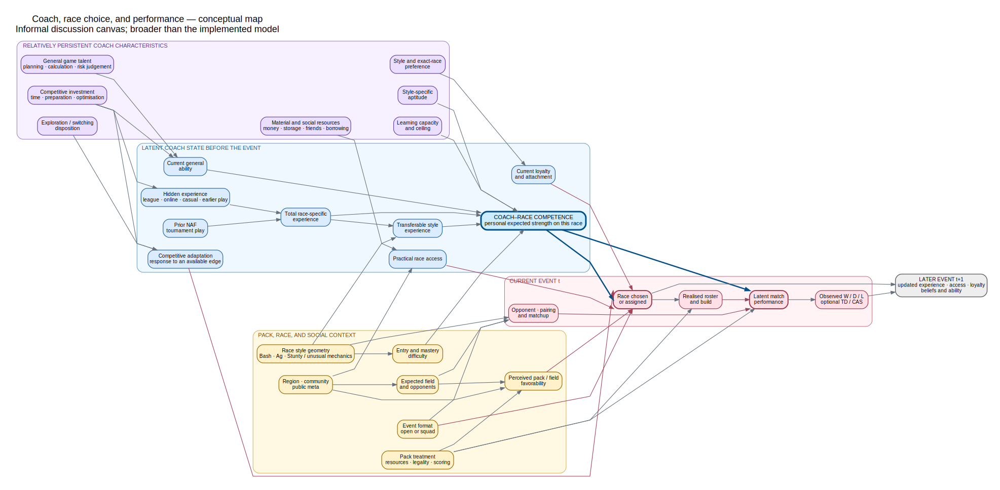

# Coach, race choice, and performance — conceptual map

Status: informal discussion canvas. This is intentionally broader than the
implemented model. Arrows mean "plausibly influences" rather than a formal,
complete causal claim. The map may contain concepts that cannot be separately
identified from NAF data.

The deliberately reduced statistical proposal inspired by this map is
recorded separately in
[JOINT_COACH_RACE_MODEL_SCRATCHPAD.md](JOINT_COACH_RACE_MODEL_SCRATCHPAD.md).

The standalone rendered version is
[player_race_concept_map.svg](diagrams/player_race_concept_map.svg); its
editable source is [player_race_concept_map.dot](diagrams/player_race_concept_map.dot).

The Mermaid source below is retained as a Markdown-native alternative.

```mermaid
flowchart LR
  %% ───────────────────────────── Context ─────────────────────────────
  subgraph CONTEXT[Pack, race, and social context]
    direction TB
    PACK[Pack treatment<br/>resources, legality, scoring]
    RACE[Race style geometry<br/>contact · mobility · stunty/unreliability]
    DIFF[Entry and mastery difficulty]
    META[Region, community, public meta]
    FORMAT[Event format<br/>open or squad]
    FIELD[Expected field and opponents]
    FAV[Perceived pack/field favorability]
  end

  %% ───────────────────── Persistent coach concepts ──────────────────
  subgraph TRAITS[Relatively persistent coach characteristics]
    direction TB
    TALENT[General game talent<br/>planning, calculation, risk judgement]
    STYLEAPT[Style-specific aptitude]
    LEARN[Learning capacity / ceiling]
    INVEST[Competitive investment<br/>time, preparation, willingness to optimise]
    PREF[Style and exact-race preference]
    EXPLORE[Exploration / switching disposition]
    RESOURCES[Material and social resources<br/>money, storage, friends, borrowing]
  end

  %% ───────────────────── Latent pre-event state ─────────────────────
  subgraph STATE[Coach state immediately before the event]
    direction TB
    GABILITY[Current general ability]
    HEXP[Hidden experience<br/>league, online, casual, earlier play]
    TEXP[Total race-specific experience]
    STYLEEXP[Transferable style experience]
    COMP[Coach-race competence<br/>personal expected strength on this race]
    ACCESS[Practical race access]
    LOYALTY[Current loyalty / attachment]
    ADAPT[Competitive adaptation<br/>responsiveness to an available edge]
  end

  %% ─────────────────────── Observable evidence ──────────────────────
  subgraph OBS[Strictly-prior observable evidence]
    direction TB
    NAFH[NAF race history<br/>games, recency, last race]
    RESULTS[Prior NAF results]
    REPERTOIRE[Derived breadth, entropy<br/>and switching rate]
    RATING[Elo/Glicko-like summary]
  end

  %% ───────────────────── Choice and performance ─────────────────────
  subgraph CURRENT[Current event]
    direction TB
    CHOICE[Race chosen / assigned]
    BUILD[Realised roster and build]
    PAIR[Opponent, pairing, and matchup]
    PERFORMANCE[Latent match performance]
    OUTCOME[Observed W / D / L<br/>optional TD/CAS]
  end

  subgraph NEXT[Later events]
    direction TB
    FUTURE[Updated experience, access,<br/>loyalty, beliefs, and ability]
  end

  %% Context structure
  RACE --> DIFF
  RACE --> STYLEEXP
  RACE --> PAIR
  PACK --> FAV
  PACK --> BUILD
  PACK --> PERFORMANCE
  META --> FAV
  META --> FIELD
  META --> ACCESS
  FORMAT --> CHOICE
  FORMAT --> PAIR
  FIELD --> FAV
  FIELD --> PAIR

  %% Formation of ability and preparedness
  TALENT --> GABILITY
  STYLEAPT --> COMP
  LEARN --> COMP
  INVEST --> GABILITY
  INVEST --> HEXP
  INVEST --> ADAPT
  HEXP --> TEXP
  NAFH -. partial observation .-> TEXP
  TEXP --> COMP
  TEXP --> STYLEEXP
  STYLEEXP --> COMP
  GABILITY --> COMP
  DIFF --> COMP

  %% Preference, access, and switching
  PREF --> LOYALTY
  EXPLORE --> ADAPT
  RESOURCES --> ACCESS
  NAFH -. evidence about .-> LOYALTY
  REPERTOIRE -. evidence about .-> ADAPT

  %% Joint choice-performance heart
  ACCESS --> CHOICE
  LOYALTY --> CHOICE
  ADAPT --> CHOICE
  FAV --> CHOICE
  COMP --> CHOICE
  CHOICE --> BUILD
  BUILD --> PERFORMANCE
  COMP --> PERFORMANCE
  PAIR --> PERFORMANCE
  PERFORMANCE --> OUTCOME

  %% Observational summaries, not underlying strength
  NAFH --> REPERTOIRE
  RESULTS --> RATING
  NAFH --> RATING
  GABILITY -. leaves evidence in .-> RESULTS
  COMP -. leaves evidence in .-> RESULTS

  %% Explicitly future-facing feedback
  CHOICE --> FUTURE
  OUTCOME --> FUTURE
  FUTURE -. next event .-> NAFH
  FUTURE -. next event .-> LOYALTY
  FUTURE -. next event .-> TEXP

  %% Styling
  classDef context fill:#fff1c9,stroke:#9b6a00,stroke-width:1.5px,color:#2c2000;
  classDef trait fill:#eadfff,stroke:#6842a6,stroke-width:1.5px,color:#24143c;
  classDef latent fill:#dcecff,stroke:#2867a3,stroke-width:1.5px,color:#10243a;
  classDef observed fill:#dcf4df,stroke:#31733a,stroke-width:1.5px,color:#102a14;
  classDef current fill:#ffe0e6,stroke:#9d3850,stroke-width:1.5px,color:#36121b;
  classDef future fill:#eeeeee,stroke:#666,stroke-width:1.5px,color:#222;
  classDef heart fill:#d8f0ff,stroke:#004f87,stroke-width:3px,color:#08253a;

  class PACK,RACE,DIFF,META,FORMAT,FIELD,FAV context;
  class TALENT,STYLEAPT,LEARN,INVEST,PREF,EXPLORE,RESOURCES trait;
  class GABILITY,HEXP,TEXP,STYLEEXP,ACCESS,LOYALTY,ADAPT latent;
  class COMP heart;
  class NAFH,RESULTS,REPERTOIRE,RATING observed;
  class CHOICE,BUILD,PAIR,PERFORMANCE,OUTCOME current;
  class FUTURE future;
```

## How to read it

- **Solid arrows** mean a plausible influence worth keeping in mind.
- **Dashed arrows** mean partial observation, evidentiary association, or a
  next-event update—not a clean same-event causal effect.
- The thick-bordered **coach–race competence** node is the heart of the joint
  idea: it can affect both the probability of choosing a race and performance
  after choosing it.
- `Elo/Glicko-like summary` is downstream of prior results and history. It is
  evidence about strength, not strength itself.
- `Practical race access` deliberately combines ownership, borrowing, money,
  friends, storage, and preparation feasibility. The broad map distinguishes
  it from psychological loyalty even though NAF-only data may not.
- `Competitive adaptation` is the neutral name for the proposed
  "power-gamer-ness" construct: willingness and ability to respond to an
  available competitive edge. In an implemented choice model it would most
  naturally appear as a coach-specific response to favorability and
  unfamiliar-race friction, not as a standalone intercept.
- Contact and mobility are not constrained to sum to one. Stunty/unreliable
  mechanics are a separate part of the race geometry.
- The future-state box prevents learning and loyalty feedback from being read
  as same-event reverse causation.

## Observationally entangled clusters

The map intentionally keeps these concepts separate for discussion, although
the available data may require collapsing them:

1. Hidden experience, starting aptitude, learning rate, and preparation.
2. Ownership/access, psychological loyalty, preference, and switching cost.
3. General ability, style-specific aptitude, and coach–race competence.
4. Competitive investment, exploration, and responsiveness to favorability.
5. Pack treatment, enabled build, matchup exposure, and realised performance.

The eventual model should be drawn as a highlighted subset of this map rather
than replacing it. Greyed-out nodes would then remain visible as omitted
mechanisms and possible sources of residual structure or bias.
