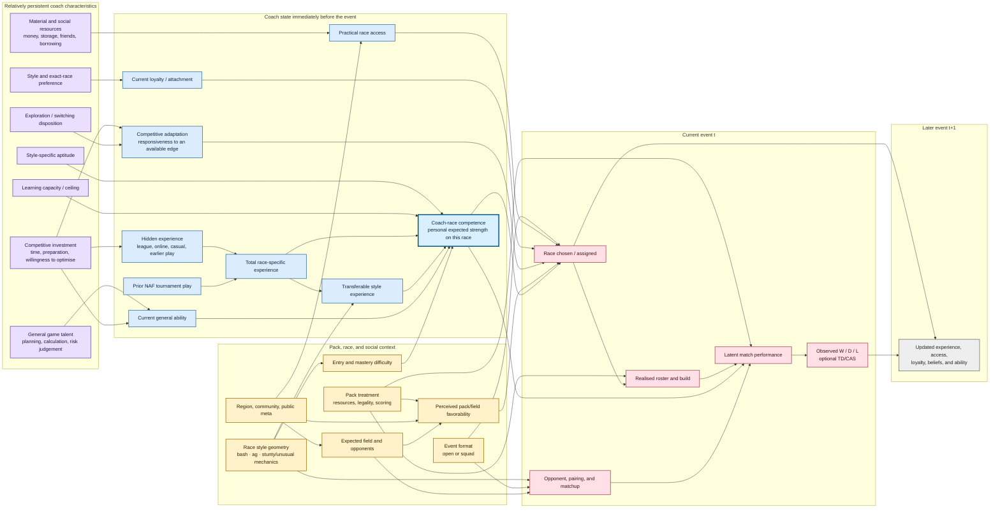
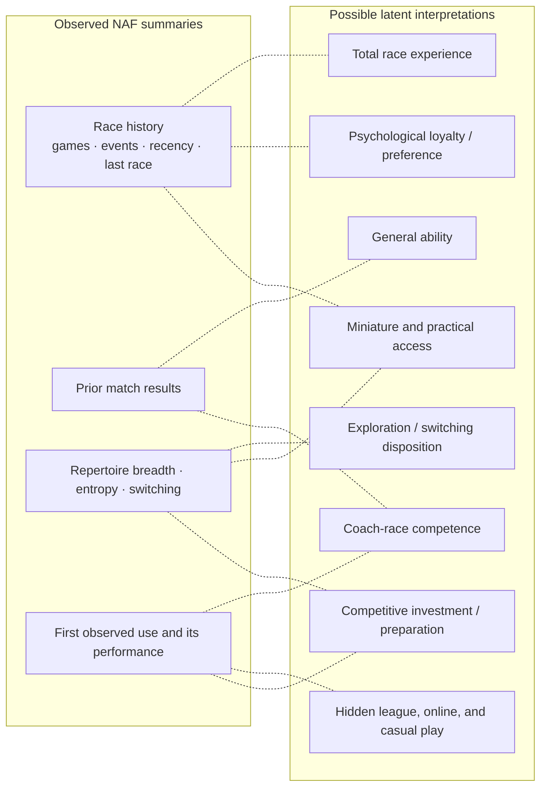

# Coach, race choice, and performance — conceptual map

Status: informal discussion canvas. This is intentionally broader than the
implemented model. Arrows mean "plausibly influences" rather than a formal,
complete causal claim. The map may contain concepts that cannot be separately
identified from NAF data.

The deliberately reduced statistical proposal inspired by this map is
recorded separately in
[JOINT_COACH_RACE_MODEL_SCRATCHPAD.md](JOINT_COACH_RACE_MODEL_SCRATCHPAD.md).

The standalone rendered version is
[player_race_concept_map.svg](diagrams/player_race_concept_map.svg); its
editable source is [player_race_concept_map.dot](diagrams/player_race_concept_map.dot).

A second, more staged overview incorporating the independent visual and
conceptual reviews is available as
[player_race_process_map.svg](diagrams/player_race_process_map.svg), with
editable source at
[player_race_process_map.dot](diagrams/player_race_process_map.dot). It keeps
the original map as the broad inventory and uses the second map to clarify
selection, tournament realisation, and time.

Observed-data relationships are kept out of the influence network. They have
their own noncausal proxy map:
[player_race_proxy_map.svg](diagrams/player_race_proxy_map.svg), with editable
source at [player_race_proxy_map.dot](diagrams/player_race_proxy_map.dot).

The Mermaid source below is retained as a Markdown-native alternative.

## How to read it

- **Solid arrows** mean a plausible influence worth keeping in mind.
- In the rendered Graphviz version, muted-red arrows converge on race choice
  and the current-event process; thick blue arrows highlight the two shared
  coach–race competence paths. These colours are routing aids, not different
  causal claims.
- Evidence and measurement relationships are deliberately absent. They are
  incomplete if mixed into this network and belong in the separate proxy map.
- The thick-bordered **coach–race competence** node is the heart of the joint
  idea: it can affect both the probability of choosing a race and performance
  after choosing it.
- `Practical race access` deliberately combines ownership, borrowing, money,
  friends, storage, and preparation feasibility. The broad map distinguishes
  it from psychological loyalty even though NAF-only data may not.
- `Competitive adaptation` is the neutral name for the proposed
  "power-gamer-ness" construct: willingness and ability to respond to an
  available competitive edge. In an implemented choice model it would most
  naturally appear as a coach-specific response to favorability and
  unfamiliar-race friction, not as a standalone intercept.
- Bash and Ag are separate Blood Bowl dimensions and are not constrained to
  sum to one. Stunty and unusual mechanics are separate parts of the race
  geometry.
- The event-`t+1` box makes learning and loyalty feedback temporal rather than
  same-event reverse causation.

## Observation and proxy map

This second network is explicitly noncausal. Undirected dotted connections
mean only that an observation may contain information about a concept. It is
not exhaustive, and no direction of causation or Bayesian updating is implied.

## Observationally entangled clusters

The map intentionally keeps these concepts separate for discussion, although
the available data may require collapsing them:

1. Hidden experience, starting aptitude, learning rate, and preparation.
2. Ownership/access, psychological loyalty, preference, and switching cost.
3. General ability, style-specific aptitude, and coach–race competence.
4. Competitive investment, exploration, and responsiveness to favorability.
5. Pack treatment, enabled build, matchup exposure, and realised performance.

The eventual model should be drawn as a highlighted subset of this map rather
than replacing it. Greyed-out nodes would then remain visible as omitted
mechanisms and possible sources of residual structure or bias.
